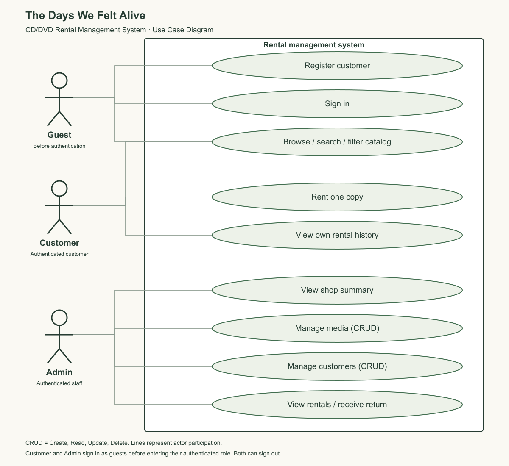

# The Days We Felt Alive — CD/DVD Rental Management System

A small full-stack rental shop for music and movie CDs/DVDs. Customers browse and rent one copy; administrators maintain media/customers and record physical returns. The presentation follows catalog → rental → return.

**Course:** 66-131216 FRONT-END SOFTWARE DEVELOPMENT
**Team member:** Htut Kaung San — **b67103023**

## Documentation and assignment requirements

- [Software Requirements Specification](docs/SRS.md): objectives, scope, roles, functional/non-functional requirements, validation, use cases and acceptance criteria.
- [Use Case Diagram](docs/use-case-diagram.png) ([editable SVG](docs/use-case-diagram.svg)).
- [Verification evidence](docs/verification.md).
- [Submission checklist](docs/submission-checklist.md).
- [Final eight-slide presentation](https://github.com/htutkaungsan/the-days-we-felt-alive-backend/blob/main/docs/presentation/the-days-we-felt-alive-final.pptx).
- [Backend API, database documentation, demo guide and eight-slide presentation](https://github.com/htutkaungsan/the-days-we-felt-alive-backend).



## Architecture and technology

Angular 22 + Bootstrap 5 + custom CSS → HttpClient/RxJS → Express API → MySQL 8.4. Node.js 24 runs the API/build tools. JWT authenticates users; bcrypt hashes passwords. Docker runs unprivileged Nginx, the API and a private persistent database.


Nginx forwards `/images/` for local artwork and `/api/v1` to `express-api:3000` over the backend's Docker network. Angular development uses its proxy to localhost:3017. Only the API accesses MySQL. See [ER diagram](docs/er-diagram.png).

```text
repository root/
├── frontend/              Angular application
│   ├── src/app/core/      API, auth, guards, interceptor, validators
│   ├── src/app/pages/     Customer and admin pages
│   ├── angular.json
│   └── package.json
├── docs/                  SRS, diagram images/source and verification
├── Dockerfile
├── docker-compose.yml
├── nginx.conf
└── README.md
```

## Clone and run with Docker

Prerequisites: Git and running Docker Desktop / Docker Compose. Clone both repositories into the same parent folder:

```sh
mkdir alive-rental
cd alive-rental
git clone https://github.com/htutkaungsan/the-days-we-felt-alive-backend.git backend
git clone https://github.com/htutkaungsan/the-days-we-felt-alive-frontend.git web
cd backend
docker compose up -d --build
cd ../web
docker compose up -d --build
```

Open **http://localhost:4200**. API: http://localhost:3017/api/v1. The backend must start first to create the shared `alive-backend_rental` network. Database initialization and sample catalog are automatic; a named volume preserves data across restarts.

Local classroom admin: `admin@example.com` / `ChangeMe123!`. Register a customer to rent. For customized credentials/secrets, copy backend `.env.example` to `.env` **before first initialization** and follow its README. Seed credentials do not reset an existing database. Public hosting requires HTTPS and non-demo secrets.

To stop each project, run `docker compose down` from its repository root. Do not add `-v` if you want to preserve database data.

## Install dependencies and run Angular locally

Prerequisite: Node.js 24.15+ and npm. Keep the backend running as above. From the frontend repository root:

```sh
cd frontend
npm ci
npm start
```

Open http://localhost:4200. Stop the frontend Docker service first if it already occupies port 4200. The development proxy is configured in `proxy.conf.json`.

Validation tests and production build, from the Angular application folder:

```sh
npm test
npm run build
```

Build output is `frontend/dist/frontend/browser` relative to the repository root. The Docker image serves that output and supports Angular deep links.

## Pages and complete CRUD

| Route | Function | Access |
|---|---|---|
| `/` | Catalog, title search, category/format filters, rental confirmation | Public; rent requires customer |
| `/login`, `/register` | JWT authentication | Public |
| `/my-rentals` | Own rental history, due dates, estimated/final fees | Customer |
| `/admin` | Shop summary | Admin |
| `/admin/media` | Create/read/update/delete catalog media | Admin |
| `/admin/customers` | Create/read/update/delete customers | Admin |
| `/admin/rentals` | Read all rentals, filter status, receive physical returns | Admin |

Delete actions require confirmation. Active rentals block deletion; records with history are archived/deactivated. Unused records are removed. Media rates are snapshotted at rental time. Fees use THB and Asia/Bangkok calendar dates.

## Responsive UI, asynchronous data and validation

Bootstrap 5 supplies the responsive catalog grid and form/control/invalid-feedback styles. Custom CSS supplies the shop palette, responsive navigation, dialogs and scrollable tables. Desktop, tablet and mobile layouts remain simple for a classroom demonstration.

API services return **RxJS Observables** through Angular HttpClient. Page actions consume them using `firstValueFrom`, then update Angular signals for results/loading/errors. Successful CRUD refreshes the displayed list. Empty/error states and submit locks are visible. Rental retries reuse the same UUID request key.

All data-entry forms use **Angular Reactive Forms**. Inline errors appear when a field is touched/blurred or edited; invalid controls receive Bootstrap `.is-invalid`, `aria-invalid` and an associated message. Invalid forms cannot be submitted. Both client and API enforce:

- Required nonblank names/titles; valid email pattern and bounded text lengths.
- New passwords: 8+ characters, uppercase, lowercase, digit, symbol; maximum 72 UTF-8 bytes. Customer edit allows an empty password to keep the old hash. Login supports existing passwords.
- Allowed music/movie and CD/DVD values; copies 1–999 whole numbers; rental duration 1–30 whole days; fees 0–9999.99 with two decimal places.

The server additionally enforces unique emails, role/ownership, stock and history constraints. Student ID is README metadata, not a customer input; no unrelated Student ID field is added.

## JWT authentication

Registration creates customers only; admin is seeded. JWT is held in **sessionStorage** for this small project, restored after refresh within the same tab, and removed on sign-out or protected 401 responses. The interceptor attaches Bearer tokens only to API requests. Route guards protect role-specific pages. The API independently verifies tokens, active account status and ownership; frontend guards alone are not authorization. A new tab requires login. JWT lifetime defaults to two hours.

## Submission

Public submission repository: [the-days-we-felt-alive-frontend](https://github.com/htutkaungsan/the-days-we-felt-alive-frontend). Its root includes `/frontend`, `/docs` and this README. The backend is linked above and is separately maintained. Submit the frontend URL through the course **MS Teams** channel by the instructor's deadline.

References: [Angular form validation](https://angular.dev/guide/forms/form-validation), [Bootstrap 5 validation](https://getbootstrap.com/docs/5.3/forms/validation/), [Angular version compatibility](https://angular.dev/reference/versions).

## Retro catalog

The backend bundles 16 researched releases from 1990–2014: Thai and English music albums and films. The catalog displays local album covers/posters with retro frames, original Thai titles, year, language, genre and selected track highlights. Image paths such as `/images/retro/boomerang.png` are served by the backend public folder through the same-origin proxy. Covers keep their complete composition with `object-fit: contain`; a fallback remains available for media without an image.

Import the backend’s `retro-catalog/retro-catalog.sql` or run its `npm run seed:retro` importer. Source links, artwork credits and digital reissue notes are in the backend’s `retro-catalog/SOURCES.md`. Stock and fees are shop demonstration data.
