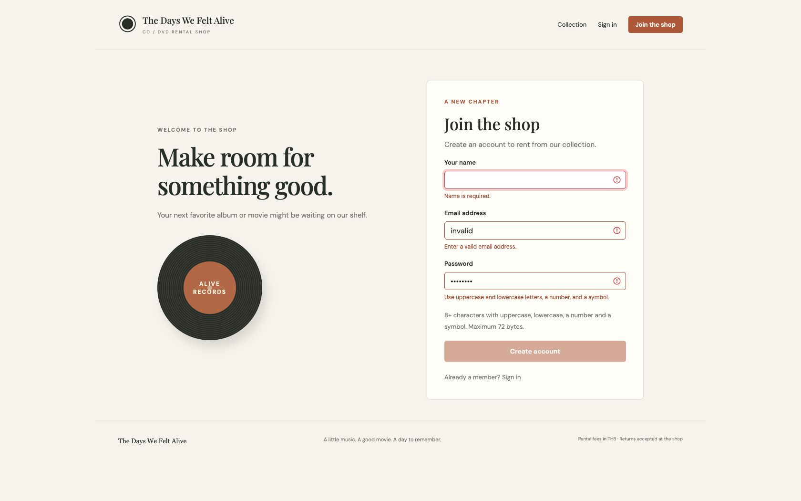
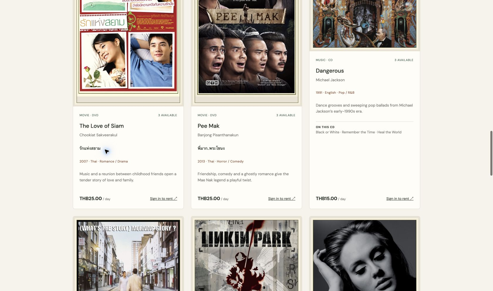
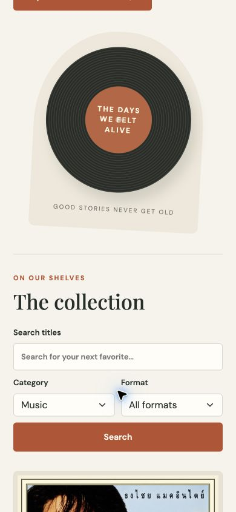
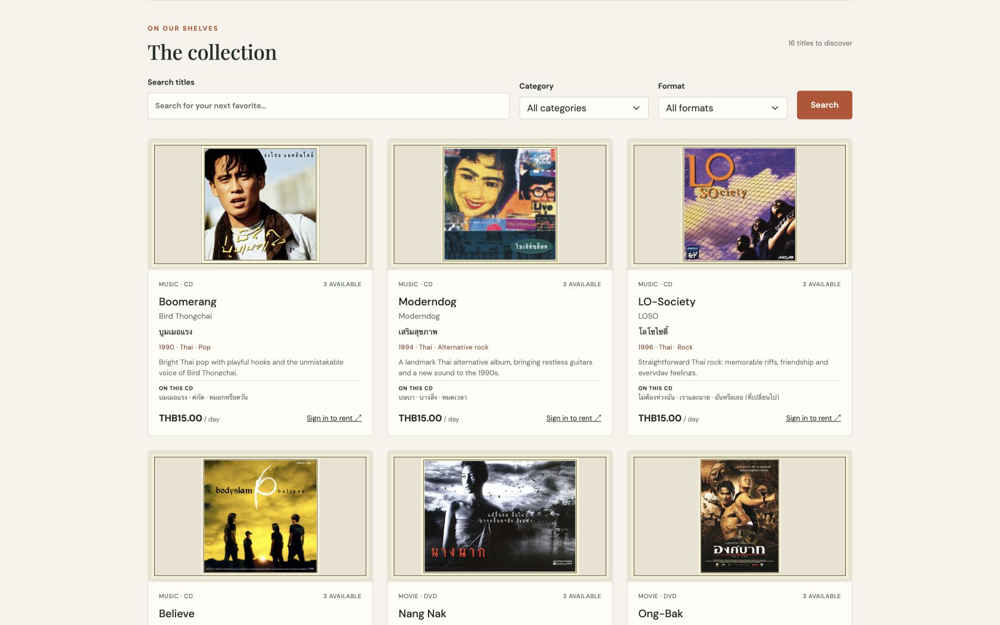
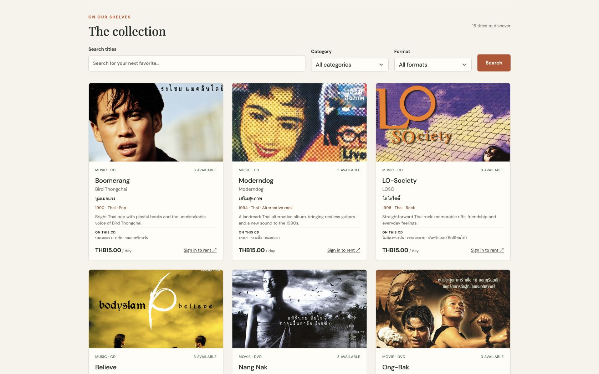
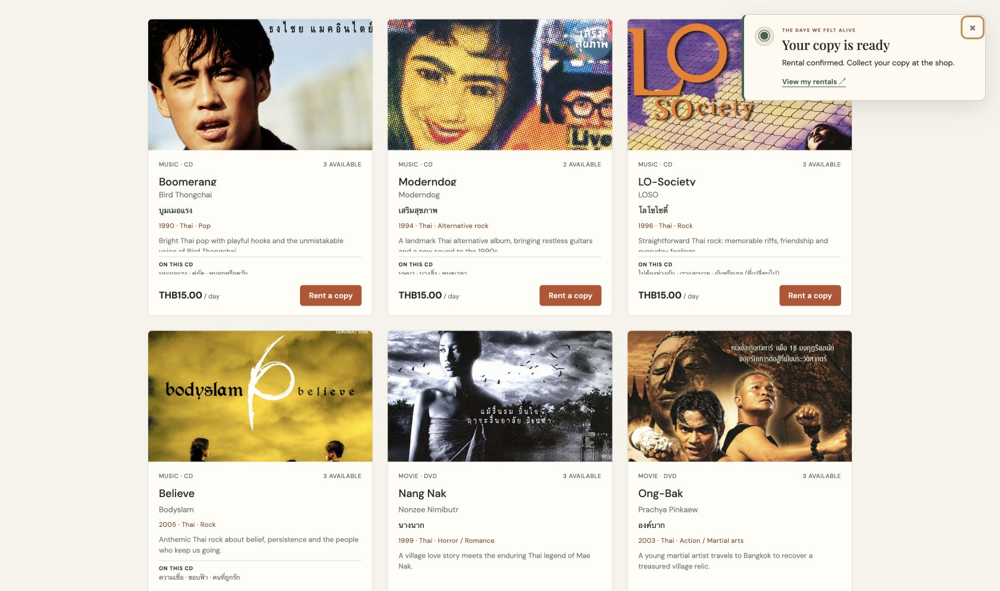

# Assignment verification — 9 October 2026

Verified against the running localhost Docker application after adding Bootstrap 5, Reactive Forms and the required repository structure. This is local evidence; no remote production deployment or MS Teams submission is claimed.

| Check | Result |
|---|---|
| Frontend shared-validator tests | 4/4 pass (`cd frontend && npm test`) |
| Angular production build | Pass; about 616 kB raw / 119 kB estimated transferred initial bundle |
| Backend unit tests | 3/3 pass: dates/fees and new-password strength/byte limit |
| Backend MySQL integration scenarios | 6/6 pass: CRUD, JWT, permissions, stock concurrency, retry keys, fee snapshots/returns, weak-password rejection |
| Both Docker images and running services | Build/start successfully using the reorganized application path |
| Required, email, weak-password inline feedback | Pass: errors appear after blur/edit; correcting values clears errors and enables submission |
| Untouched required name | Pass: entering valid email/password alone still leaves registration disabled |
| Registration → rent → history → admin return | Pass: fictional Assignment Customer registered, rented City Lights Collection for 3 days, history showed THB54.00; admin returned it at THB54.00 with no late fee |
| Media validation and editing | Pass: whitespace title, 1.5 copies and 12.345 fee rejected; existing media loaded and saved successfully |
| Customer editing | Pass: existing values loaded and saved with empty optional password |
| Refresh/session and guest guard | Pass: admin session restored after reload; after sign-out direct admin route redirected to login |
| Desktop 1440×900 | Three-column catalog; page width 1440, no page overflow |
| Tablet 768×1024 | Two-column catalog; page width 768; filter labels remain readable |
| Phone 390×844 | Single-column catalog; page width 390; stacked registration form; admin table scrolls inside its container |
| Repository/documents | Root frontend/, docs/, README; SRS + PNG/SVG use case; member name and ID; exact clone/install/run steps |

The build emits Angular's default **500 kB initial-budget warning** because the complete Bootstrap stylesheet is bundled; it remains below the 1 MB error limit and builds successfully. This is documented rather than hiding the warning by raising the budget. Four frontend tests exercise validators; they are not a full automated browser suite. The browser checks above were performed manually through the browser controls.

Complete create/read/update/delete behavior, destructive deletion restrictions and ownership are also covered by the isolated backend integration suite. The existing browser delete confirmation was previously verified; permanent deletion was not repeated in this update. Backend integration tests use their own disposable `alive_test` database.

The fictional local Assignment Customer and its returned rental remain as demonstration data. Fresh installations seed only the admin and six catalog titles; browser-created customers are not in repository seed files.

## Screenshots

- [Desktop catalog](desktop-catalog.png)
- [Tablet catalog](tablet-catalog.png)
- [Mobile catalog](mobile-catalog.png)
- [Desktop form validation](form-validation.png)
- [Mobile form validation](mobile-validation.png)
- [Successful admin return](return-flow.png)

## Retro catalog verification — 2026-10-09

The frontend Docker build and four validator tests pass. Chrome checks cover framed Thai album artwork, English album/movie filtering and a 390 × 844 mobile card layout with no horizontal overflow. All 16 local image paths are delivered through the frontend image proxy; existing media without artwork retains the fallback cover. Backend metadata/import checks and all seven integration tests pass. The existing initial-bundle warning remains below the build error threshold. See the backend retro-catalog source and verification files for artwork treatment and release references.

## Compact catalog layout — 2026-10-09

Catalog artwork uses a fixed 220px area on desktop and 200px on mobile, with `object-fit: contain`. All 16 cards have a fixed 500px height. Paragraph spacing is reduced, descriptions are limited to two visible lines and song highlights to three; full text remains in the markup and hover titles. Chrome measurements confirmed equal heights and no overlap between text and rental actions on desktop and at a 320px mobile viewport. The mobile page has no horizontal overflow. The production Docker build passed and the local frontend was refreshed.

## Full-width top-focused cover display — 2026-10-09

Following the requested display revision, catalog images use `object-fit: cover` and `object-position: center top`, with 112% width and a small upward crop. Image padding, CSS borders and outlines are removed; baked-in artwork borders are hidden by the crop. Cards stay 500px high. Desktop review and a 320px mobile check confirmed images fill their entire container, with no horizontal overflow. The production Docker build passed and the local frontend was updated.

## Themed notifications and spinning CD — 2026-10-09

General success, error and session messages now use one retro toast outlet; form field validation stays beside its input. Toasts provide accessible alert/status roles, close buttons, deduplication, a three-message limit and hover/focus timer pauses. Rental confirmation includes a working View my rentals link. The hero CD rotates once every 24 seconds and respects reduced-motion preferences.

Chrome verified incorrect-password, successful login, logout and rental confirmation messages; the rental link opens history. Test rental #6 (Moderndog) was returned through the admin dialog, restoring its available copy. At 320px the rental toast stays inside the viewport (x=16, width=288px); the final catalog check has no horizontal overflow. Six frontend unit tests and the Docker production build pass. The existing 500kB bundle warning remains below the error limit.

